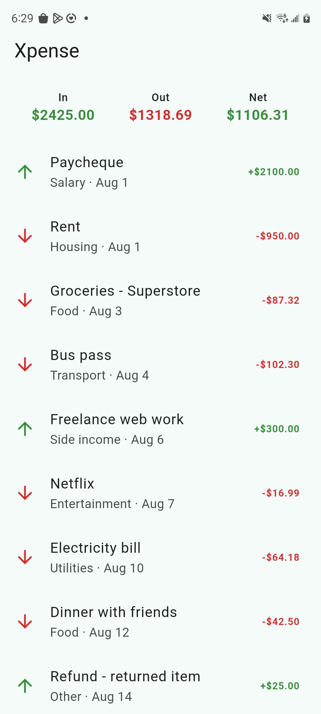

# Xpense

Xpense is a personal expense-tracking app for Android, built with Flutter, giving a clear, at-a-glance view of money moving in and out of your bank accounts.

## Status

Currently, the app now persists transactions locally in SQLite: you can add, edit, and delete transactions, and everything survives closing and reopening the app. Multiple accounts, categories as a first-class concept, and period summaries arrive in later sprints.

## Features

- Scrollable list of income and expense transactions, newest first, each showing description, category, date, and a colour-coded, signed amount.
- A balance header showing total money in, total money out, and net balance which is computed live from the stored transactions, not hardcoded.
- Add a transaction via a validated form (description, category, amount, type, date).
- Tap a transaction to edit it in the same form, pre-filled.
- Swipe a transaction left to delete it.
- All data persists in a local SQLite database. A fresh install is seeded with sample transactions on first launch.

## Running the app

1. Install the Flutter SDK ([flutter.dev](https://flutter.dev)) and confirm your setup with `flutter doctor`.
2. Clone this repository and run `flutter pub get`.
3. Connect an Android device (USB debugging enabled) or start an emulator.
4. Run `flutter run`.

## Running tests

- `flutter test` - unit tests on the `Transaction` model, repository tests against a real in-memory SQLite database, and a widget test on `TransactionListScreen`.
- `flutter analyze` - static analysis; the project is expected to stay clean.

Database tests run on your desktop without a device: `sqflite_common_ffi` provides a desktop SQLite driver, and each test opens a fresh in-memory database so tests dont touch a disk or share data.

## Architecture

The code is organized by layer:

- `lib/models/` - plain Dart data (`Transaction`) and pure logic (the `TransactionSummary` extension). `Transaction` is immutable; `copyWith` produces modified copies, and `toMap`/`fromMap` translate to and from the row shape SQLite understands.
- `lib/data/` - where transactions come from and go to.
  - `TransactionDatabase` owns the SQLite connection (singleton), the file location, and the schema.
  - `TransactionRepository` is the only thing the rest of the app talks to for reading and writing transactions. It exposes `getAll`, `insert`, `update`, `delete`, and `seedIfEmpty`, and works purely in `Transaction` objects.
  - `sample_transactions.dart` provides the first-run seed data.
- `lib/widgets/` - small, reusable presentational widgets (`TransactionTile`, `BalanceSummary`).
- `lib/screens/` - full screens that compose the above (`TransactionListScreen`, `TransactionFormScreen`).

The repository is a concrete class rather than an interface because there is exactly one storage implementation (for now)

## Dependencies

- `sqflite` - SQLite for Flutter. There is no database in Dart's standard library.
- `path` - builds filesystem paths correctly across platforms.
- `sqflite_common_ffi` (dev only) - desktop SQLite driver so database code can be tested without a device.

